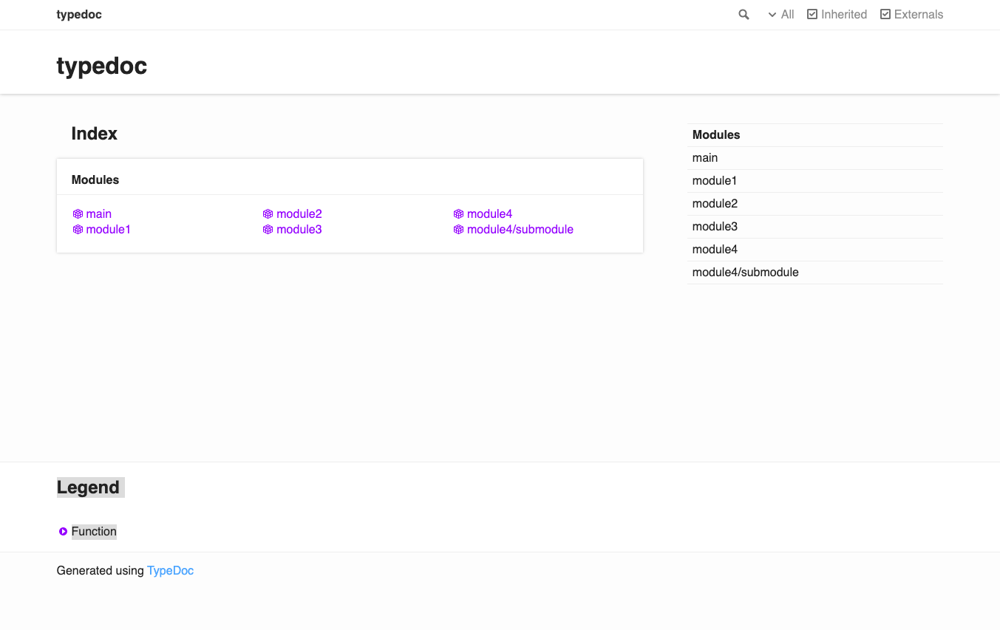
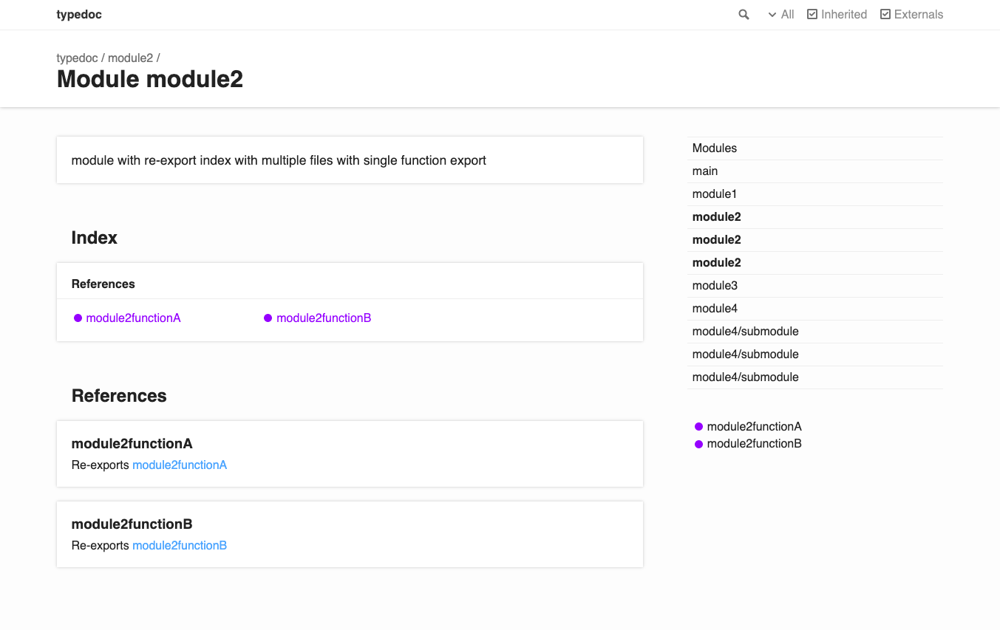
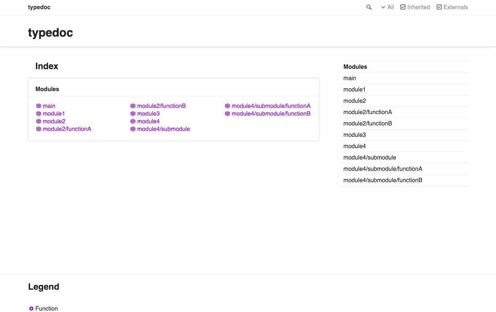
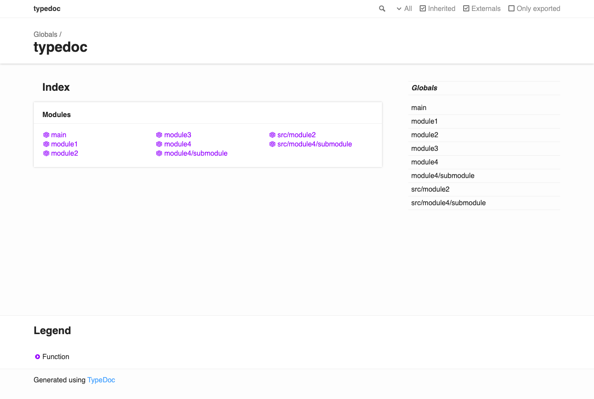

# exsample for typedoc-plugin-merge-modules

```
src
├── index.ts
├── module1
│   └── index.ts
├── module2
│   ├── functionA.ts
│   ├── functionB.ts
│   └── index.ts
├── module3.ts
└── module4
    ├── index.ts
    └── submodule
        ├── functionA.ts
        ├── functionB.ts
        └── index.ts

4 directories, 10 files
```

v20-with-plugin | v20-bad | v20 | v19
---|---|---|---
TypeDoc v20 with `typedoc-plugin-merge-modules` | TypeDoc v20 with duplicate module definition | plane TypeDoc v20 | TypeDoc v19 with `typedoc-plugin-external-module-name`
 |  |  | 
